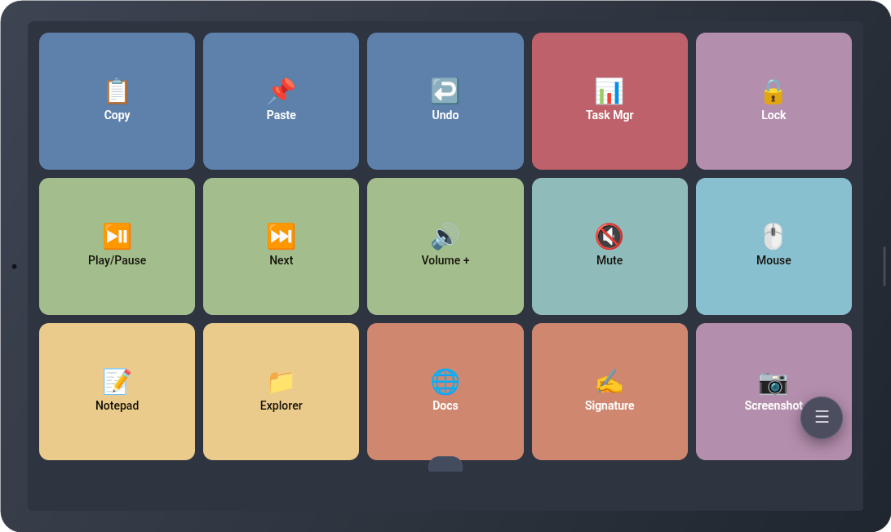
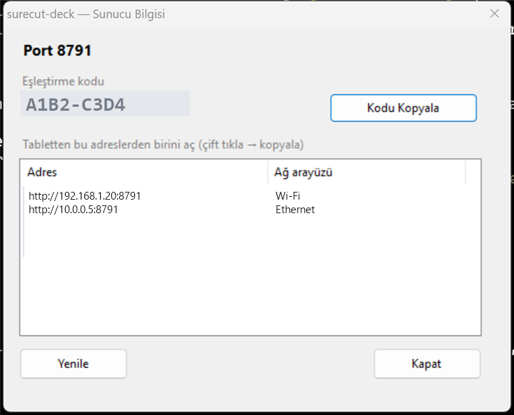
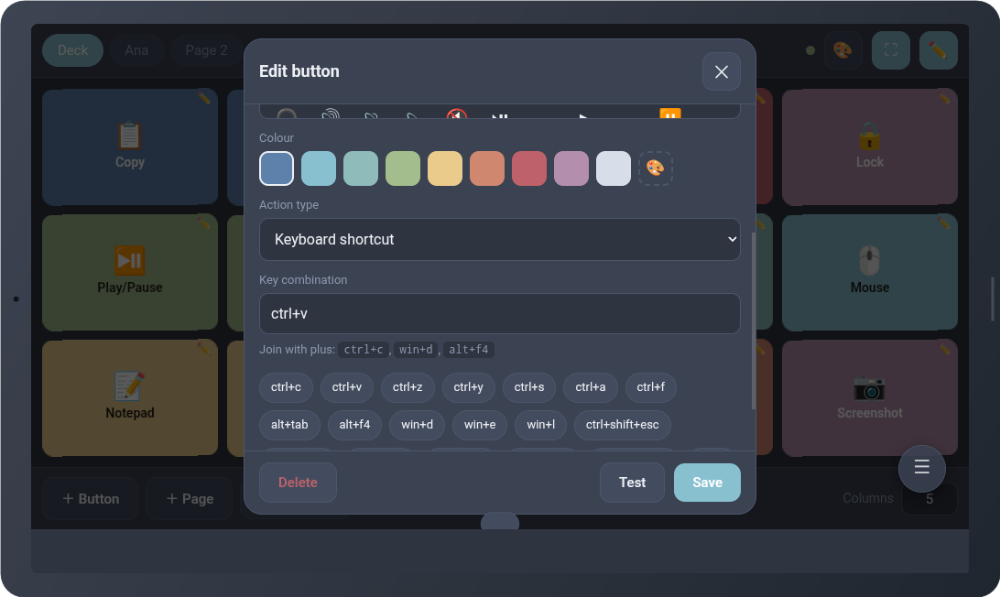
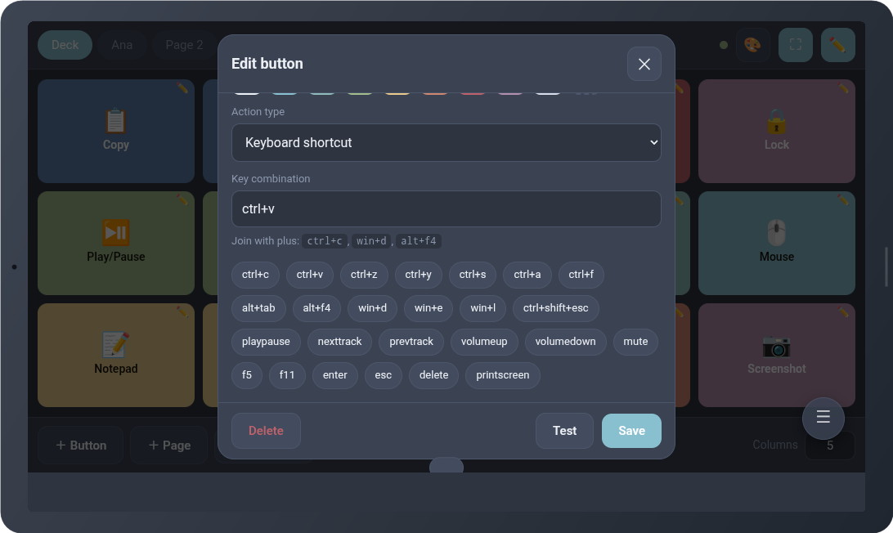
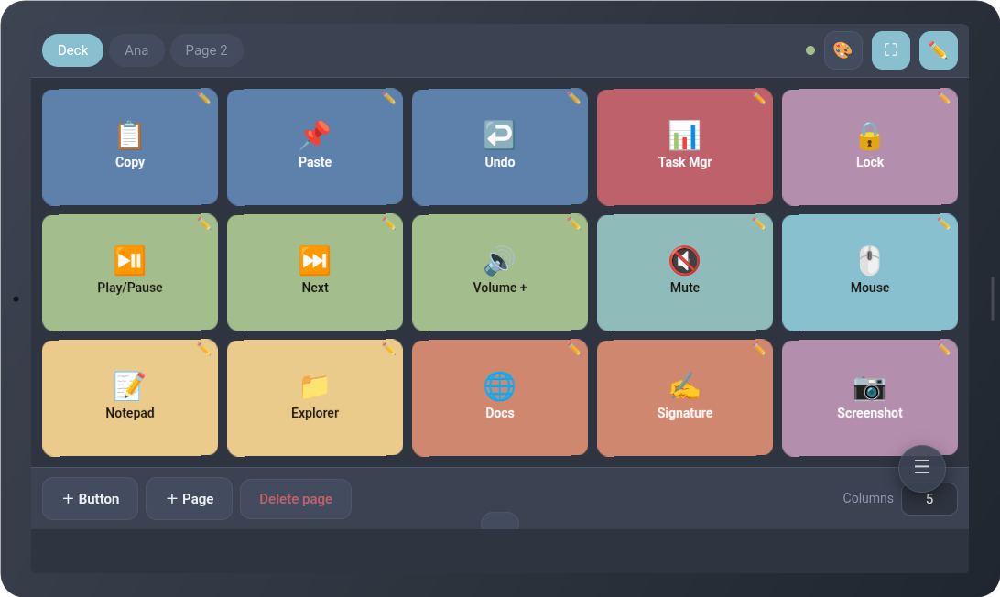
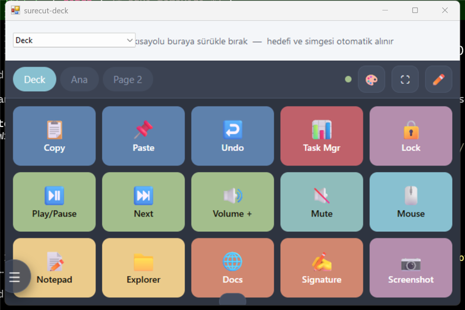
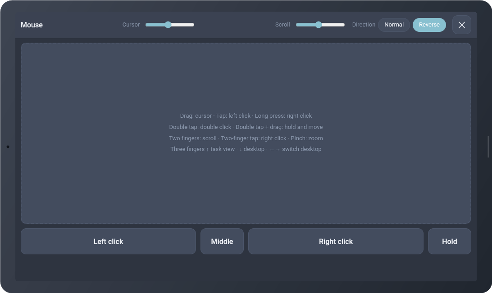
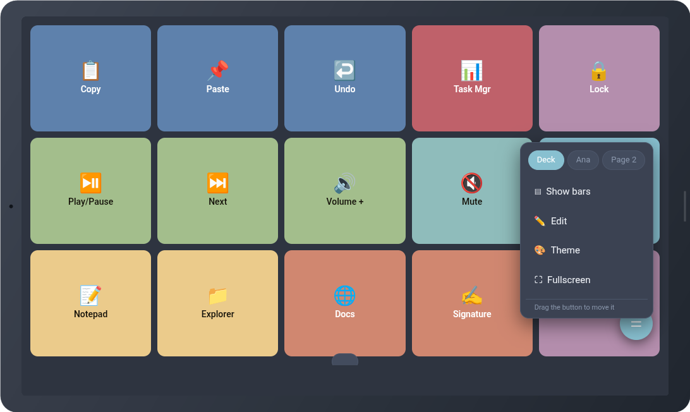
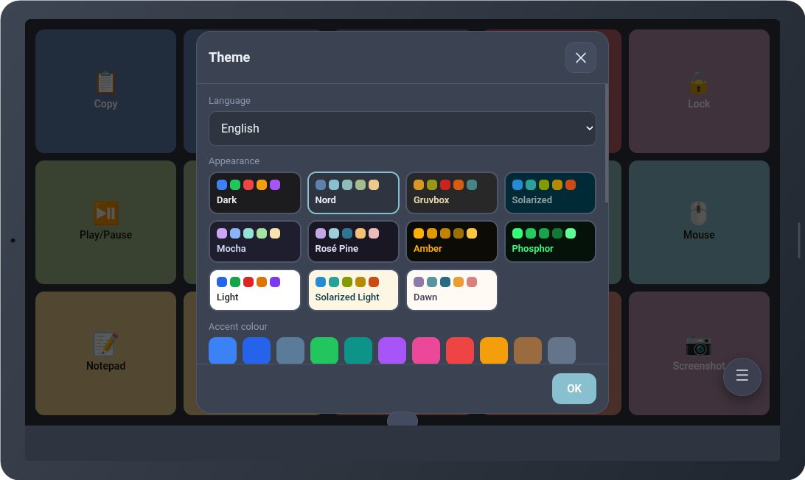
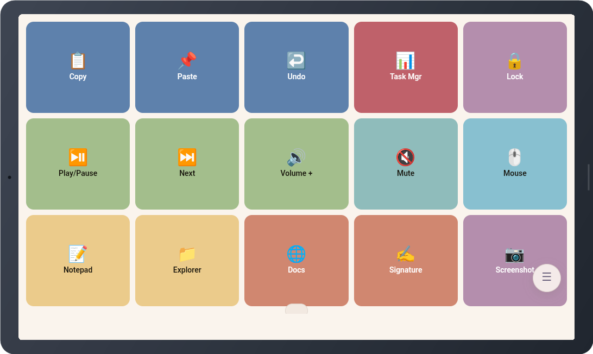

# Surecut Deck

**Turn a spare tablet into a control deck for your PC**

> Self-hosted · No app store · Nothing leaves your network

Surecut Deck runs a small server on your Windows machine and serves its own interface. The tablet just opens a web address — there is no app to install, no account to create, and no cloud in the middle.



<sub>The deck on a 1024×600 Android tablet, running the Nord theme in full screen.</sub>

📖 Illustrated guide: [English](docs/guide-en.html) · [Türkçe](docs/guide-tr.html) · [Español](docs/guide-es.html) · [Français](docs/guide-fr.html) · [Deutsch](docs/guide-de.html) · [Italiano](docs/guide-it.html) · [Português](docs/guide-pt.html) · [Русский](docs/guide-ru.html) · [Українська](docs/guide-uk.html) · [Polski](docs/guide-pl.html) · [العربية](docs/guide-ar.html) · [فارسی](docs/guide-fa.html) · [اردو](docs/guide-ur.html) · [中文](docs/guide-zh.html) · [日本語](docs/guide-ja.html) · [한국어](docs/guide-ko.html) · [हिन्दी](docs/guide-hi.html) · [বাংলা](docs/guide-bn.html) · [Indonesia](docs/guide-id.html) · [Tiếng Việt](docs/guide-vi.html)

## How it works

| | |
|---|---|
| **Your PC hosts it** | A tray app starts a local server and keeps it running. It is the only thing you install. |
| **The tablet opens a URL** | Any browser on the same network. Add it to the home screen and it behaves like an app. |
| **Buttons send real input** | Presses become genuine Windows keyboard and mouse events, so any program responds to them. |

## Getting connected

### 1. Start the host

Run `start.cmd`. An icon appears in the system tray and stays there. Left-click it any time to see the pairing details or open the editor.

### 2. Open the address on the tablet

The host window lists every address your PC can be reached at. Type one into the tablet's browser, then enter the pairing code shown next to it.



<sub>Server details, from the tray icon. The code and addresses here are examples.</sub>

### 3. Make it feel like an app

Tap **⛶** for full screen, or use your browser's **Add to home screen**. In full screen the tablet also stays awake while the deck is open.

## Buttons do more than keystrokes

Tap the pencil to enter edit mode, then tap any button to edit it — or press and hold to drag it somewhere else. Every button has a label, an icon, a colour and one action.



<sub>Label, icon picker and colour.</sub>



<sub>Action type, with ready-made shortcuts to pick from.</sub>

| Action | What it does |
|---|---|
| Keyboard shortcut | Any combination — `ctrl+c`, `win+d`, `alt+f4`, media keys, volume |
| Type text | Writes a block of text for you, line breaks included |
| Open app / file | A program, a document or a folder |
| Open web address | Opens a link in your default browser |
| Run command | PowerShell or CMD |
| Mouse | Turns the tablet screen into a touchpad |
| Sequence | Several steps in order, with delays in between |

## Pick an emoji, or use the real app icon

The editor has an icon grid so you never have to type an emoji by hand. For programs there is something better: drag the shortcut in from your desktop and the real application icon comes with it.



<sub>Edit mode. Each button carries a pencil badge; hold one to reorder.</sub>

## Drag a shortcut in from the desktop

Open the editor from the tray icon and a proper desktop window appears with the same interface inside it. Drop a shortcut, program, folder or file onto the strip at the top: the target is resolved, the application icon is extracted, and the button appears on the tablet immediately.

> The editor is a native window rather than a browser tab for a specific reason. Browsers never hand a web page the *path* of a dropped file, and Chromium resolves a dropped shortcut to its target — so a browser would try to read the whole program instead of learning where it lives.



<sub>The desktop editor. Choose the page on the left, then drop shortcuts onto the strip.</sub>

<sub>**Target page** · **Drop shortcuts here**</sub>

## The screen becomes a touchpad

Give a button the **Mouse** action and pressing it turns the whole tablet into a trackpad. Two sliders set pointer and scroll speed, and scrolling can be reversed to match how you think.



<sub>Touchpad mode, with explicit buttons underneath for the clicks you don't want to guess at.</sub>

| Gesture | Result |
|---|---|
| Drag | Move the pointer |
| Tap | Left click |
| Double tap | Double click |
| Double tap, then drag | Hold the left button and move — select text, drag a window |
| Long press | Right click |
| Two fingers | Scroll, vertically and horizontally |
| Two-finger tap | Right click |
| Pinch | Zoom |
| Three fingers ↑ / ↓ | Task view / show desktop |
| Three fingers ← / → | Switch virtual desktop |

## As many pages as you need

Group buttons into pages — one for editing, one for games, one for the meeting you are always in. Swipe left or right across the deck to move between them. The floating button gets you to the pages, the editor and the themes even when the bars are hidden, and you can drag it wherever it suits you.



<sub>The floating menu: pages, bars, edit mode, theme and full screen.</sub>

## Eleven themes, and the buttons follow

Most themes come from well-known developer colour schemes — Nord, Gruvbox, Solarized, Catppuccin Mocha, Rosé Pine — plus two deliberately two-tone terminal looks and neutral light and dark. Changing the theme converts your button colours to the new palette while keeping their hues, so a blue button becomes the new theme's blue and your layout still reads the same.



<sub>Each card previews its own background and palette.</sub>



<sub>The same deck on a light theme.</sub>

## Use the whole display

**Stretch to fill** makes the rows share the full height, so two rows of buttons fill the screen instead of leaving a gap underneath. **Auto-hide bars** removes the top and bottom bars entirely and leaves only the buttons — the floating button brings them back, or hold an empty area for three seconds.

> The tablet is also set to stay awake: the screen will not time out while the deck is open.

## Twenty languages, picked automatically

The interface ships in English, Turkish, Spanish, French, German, Italian, Portuguese, Russian, Ukrainian, Polish, Arabic, Persian, Urdu, Chinese, Japanese, Korean, Hindi, Bengali, Indonesian and Vietnamese. It follows the browser's language unless you choose one, and Arabic, Persian and Urdu switch the layout to right-to-left. The choice is per device, so the tablet and the desktop editor can differ.

## Worth knowing

**Firewall** — Windows may ask to allow the connection the first time. If the tablet cannot reach the host, allow it for private networks.

**VPN** — Some VPN clients block local network traffic. If nothing connects, try with the VPN off.

**Windows asks for admin** — A program running as administrator will not accept input from a normal program. Run the host as administrator if you need shortcuts to reach those windows.

**Pairing code** — Anyone on your network who has the code can control the PC, including running commands. Keep it to yourself and don't host it on networks you don't trust.

---

## Requirements

- Windows — the host uses the Win32 `SendInput` API
- [Node.js](https://nodejs.org)
- A tablet, phone or second computer with a browser on the same network

Nothing else. The C# helper and tray app are compiled by the .NET Framework compiler that already ships with Windows, so there is no SDK to install.

## Getting started

```sh
git clone https://github.com/sanwhere/surecut-deck.git
cd surecut-deck
npm install
start.cmd
```

`start.cmd` compiles the helpers on first run and puts an icon in the system tray. Click it for the address and pairing code, then open that address on the tablet.

## How it is put together

| Part | File | Role |
|---|---|---|
| Host | `server.js` | HTTP + WebSocket, configuration, action execution |
| Input | `helper/InputHelper.cs` | Win32 `SendInput`, long-lived process driven over stdin |
| Tray & editor | `tray/TrayApp.cs`, `tray/EditorForm.cs` | Manages the host; native editor window hosting the web UI |
| Interface | `public/` | The deck itself — buttons, editor, touchpad, themes |
| Translations | `public/i18n.js` | 20 languages in one flat dictionary |

Two decisions are worth explaining, because both are easy to get wrong:

**Input goes through a compiled helper, not PowerShell.** `SendKeys` cannot send the Windows key or media keys. The helper is a long-lived process reading commands from stdin, so there is no process-spawn latency on every keystroke.

**The desktop editor is a native window, not a browser tab.** Browsers never hand a web page the *path* of a dropped file, and Chromium resolves a dropped shortcut to its target — so dragging a shortcut into a browser cannot work, however it is written. The editor is a WinForms window hosting the same web interface in WebView2, which lets the native shell read real file paths.

## Security

Every connection from the network needs a pairing code, compared in constant time. Connections from the same machine skip it: anything already running there can send input directly, so a code would add nothing.

The `Run command` action executes arbitrary commands. **Anyone on your network who has the pairing code can run commands on your PC.** Keep the code to yourself, and don't host this on networks you don't trust.

The code lives in `data/token.txt`. Delete the file and restart to roll it.

## Tests

```sh
node tests/i18ntest.js          # all 20 languages complete and consistent
node tests/colormaptest.js      # theme colour mapping preserves hues
node tests/gesturetest.js       # two-finger scroll vs. pinch decision
node tests/revisiontest.js      # stale clients cannot overwrite newer config
node tests/smoketest.js <code>  # end-to-end; verifies key injection via NumLock
node tests/mousetest.js         # mouse injection — don't touch the mouse while it runs
```

## Building the documentation

This README and the HTML guide are generated from the same content files, so a new language is one JSON file and no template changes:

```sh
node docs/build-guide.js en              # docs/guide-en.html
node docs/build-guide.js en --inline     # single self-contained file
node docs/build-readme.js en             # this README
powershell -File docs/frame-shots.ps1    # bake tablet frames into screenshots
```

Turkish developer notes, including the traps found along the way, are in [docs/notes.tr.md](docs/notes.tr.md).

